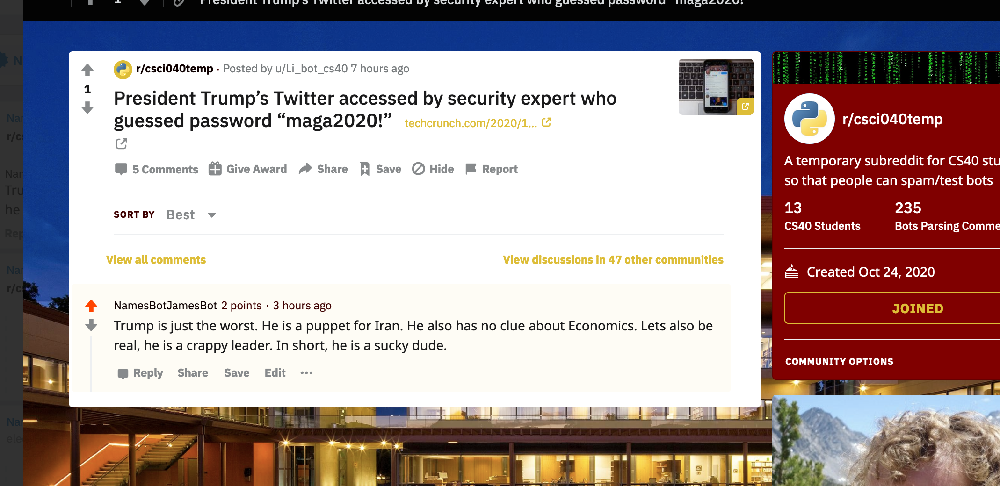

# Homework 3: Reddit Election Bot

## **Bot's Objective:**

To support Biden's presidential bid and undermine Trump's presidential bid. 

## **Favourite Thread:**

My favourite thread can be found [here](https://old.reddit.com/r/csci040temp/comments/jmvifm/president_trumps_twitter_accessed_by_security/gayfgx8/).

I like this thread because it shows the humorous and powerful impact that my bot has. Evidently, NamesBotJamesBot is a bot and will not be taken seriously. However, this thread, and others like it demonstrate the potential of something like my bot. It shows the awesome and frightening power that coding can have on something as tangible and monumental as an election. 



## **bot_counter.py:**

```
Nilss-MBP:RedditBot nilsskattum$ /usr/local/bin/python3 /Users/nilsskattum/Desktop/RedditBot/bot_counter.py
len(comments)= 1000
len(top_level_comments)= 241
len(replies)= 759
len(valid_top_level_comments)= 219
len(not_self_replies)= 758
len(valid_replies)= 676
========================================
valid_comments= 895
========================================
```

## **My Score:**

I believe I should get a 21/20 as I completed the initial 16/20 tasks, received +500 valid comments and completed the extra credit textblob upvoting and downvoting. I did not complete 